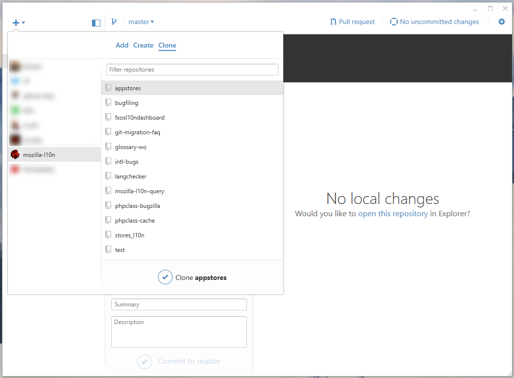
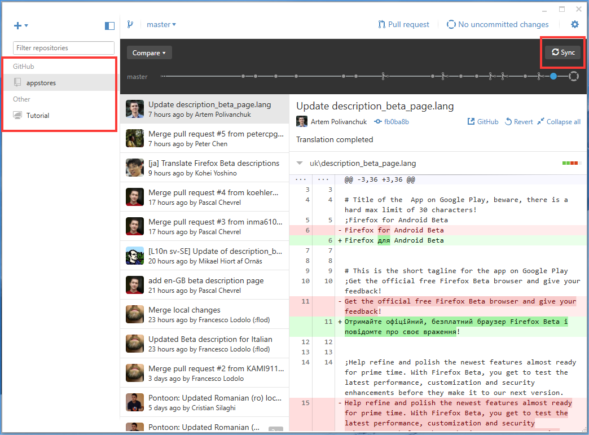
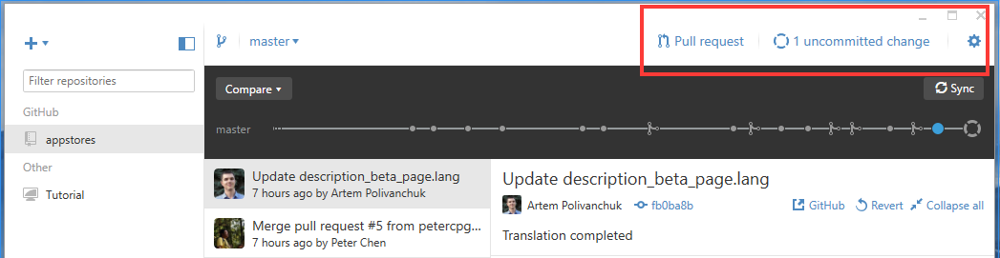
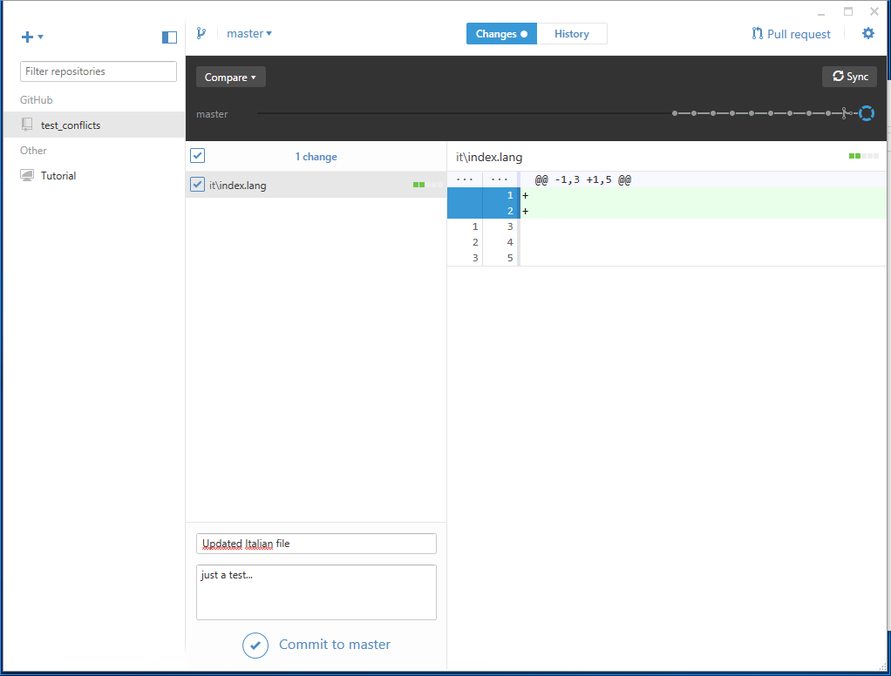
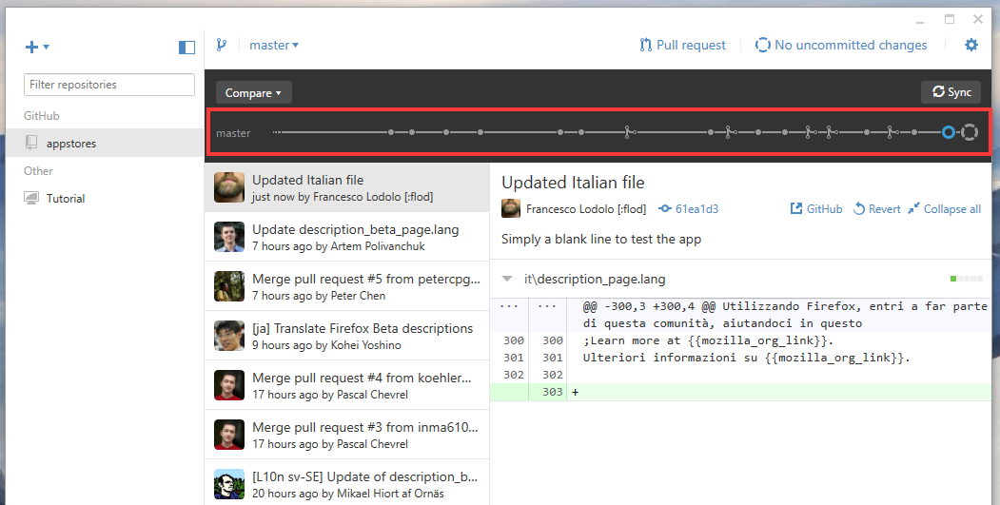

# GitHub Desktop

When you install the app, you'll have to insert the credentials you use on GitHub's website, and provide a username/email for your Git config (it will be used for commits).

Once the app is installed, open it and click on the + sign (top left corner). Select the **Clone** tab, **mozilla-l10n** in the sidebar (if you plan to clone the main repository).

Select the repository you're interested in, and then click the **Clone** button at the bottom. You'll be asked to pick where you want to store your local clone.

Once cloned, the repository will be available in your sidebar.

To update your local clone you can use the **Sync** button on the top right corner.

Let's say you have updated one of your files. In the top right corner you'll see "1 uncommitted change", click on it.

You'll have a chance to review the changed files, a visual diff of the changes, and you'll be able to commit them using the form at the bottom.

Using the graph at the top of the window, you can navigate through the history of commits.

## Git Shell
The installation will create a second icon on your desktop called **Git Shell**. This will open a shell where you can use all commands described in the main document. You can also right click on a repository to open a shell directly in that repository's folder.
