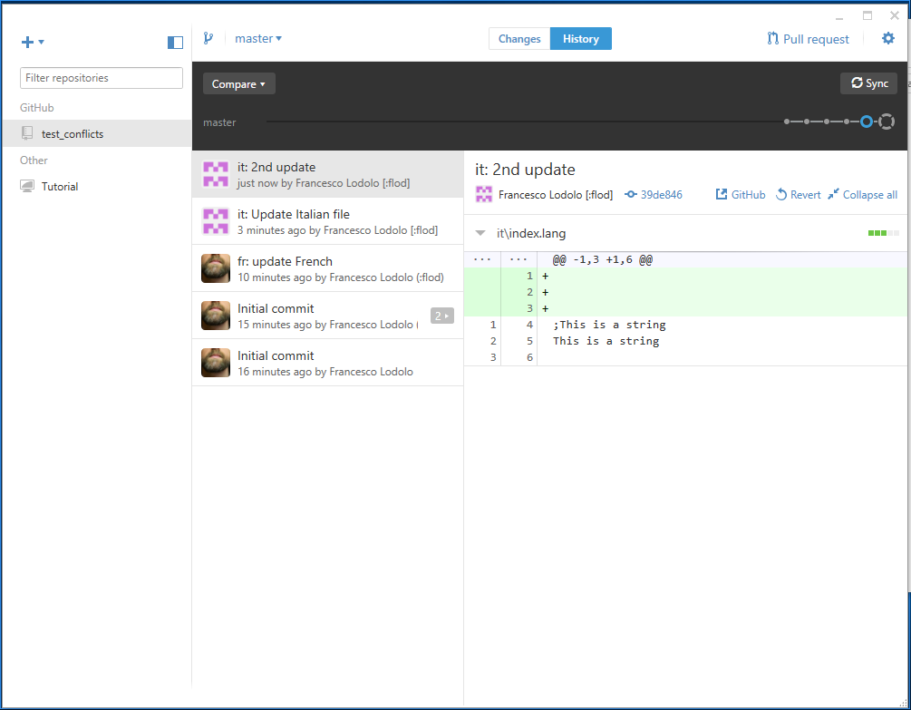
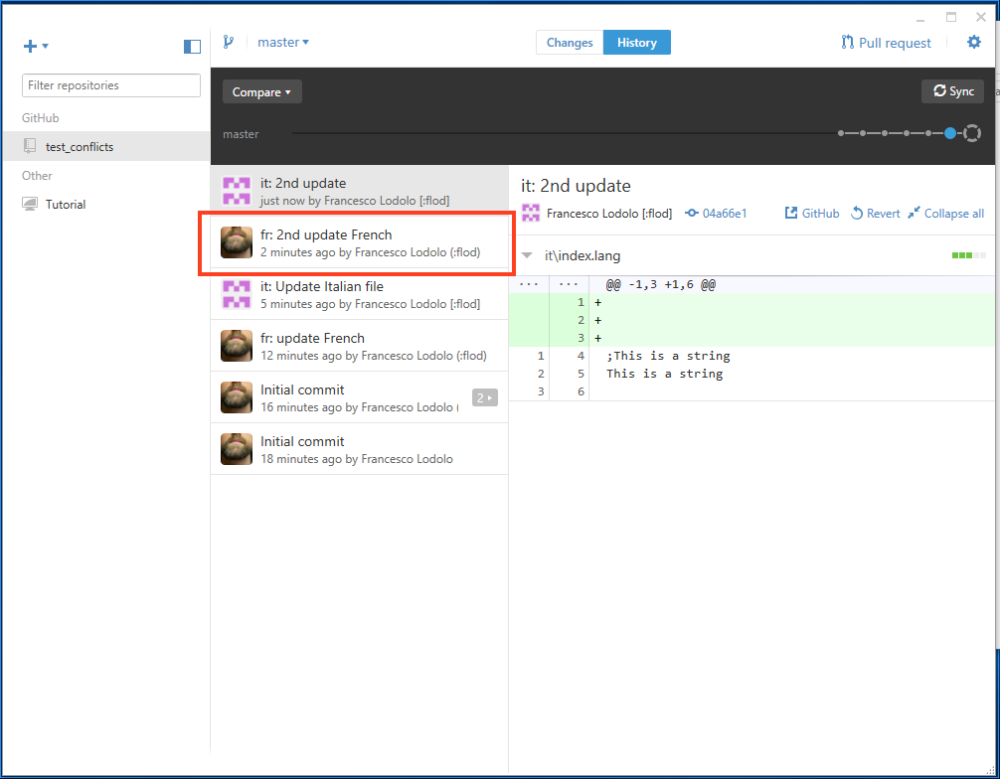
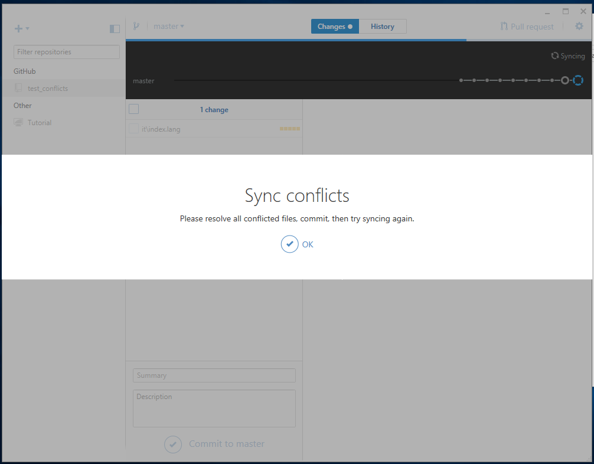
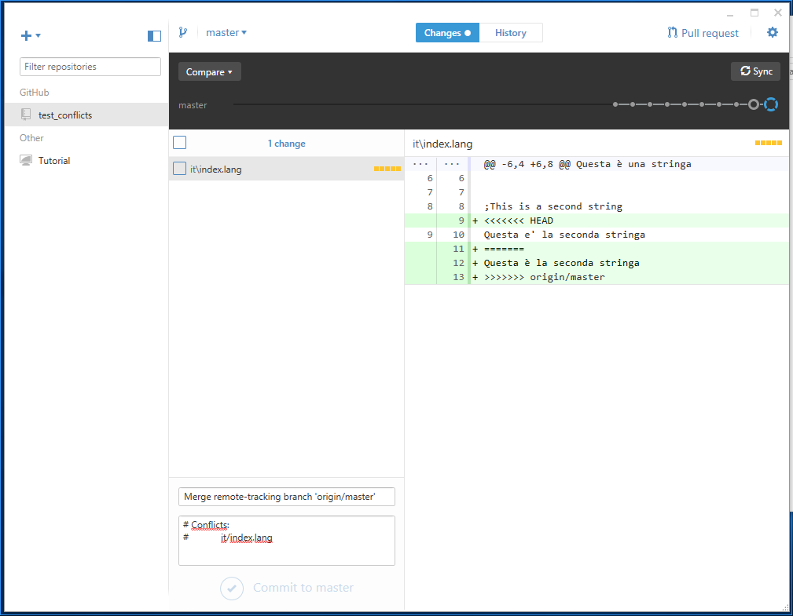
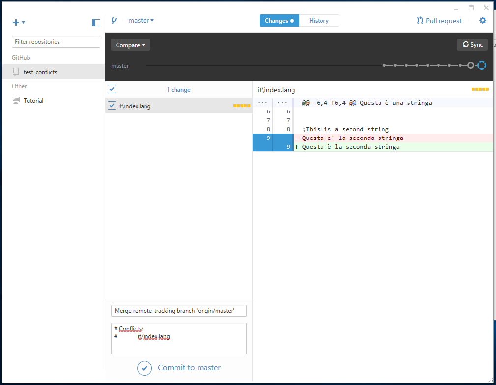

# GitHub Desktop

## Setup and Basic Usage
When you first start the app, you'll have to insert the credentials you use to access github.com. If you never used Git on the current system, you'll also have to provide a username/email for your Git config (they will be used for the commit's author).

Once the app is installed, open it and click on the + sign (top left corner) to add a new repository. Select the **Clone** tab, then **mozilla-l10n** in the sidebar if you plan to clone directly the main repository, or your account if you want to work on a fork.


Select the repository you're interested in, and then click the **Clone** button at the bottom. You'll be asked to pick where you want to store your local clone.

Once cloned, the repository will be available in your sidebar.


To update your local clone you can use the **Sync** button in the top right corner.

## Commit changes
Let's say you have updated one of your files. On top of the Windows you'll see a dot near **Changes**.


You'll have the opportunity to review the changed files, a visual diff of the changes (click on the file), and you'll be able to commit them using the form at the bottom of the window.


Using the graph at the top of the window, you can navigate through the history of commits (you can also select the **History** tab).


## Deal with Conflicts
Our repositories are used and updated daily by several localizers: it might happen that you update your local copy, commit and get an error because someone else made another commit in the meantime.

For simplicity let's consider a simple repository with only two folders: `fr` and `it`. Both repositories start with a common base, but at this point things diverge. The 'fr' owner makes a commit and pushes to production, the 'it' owner tries do the same without knowing that the remote repository changed.

This is how the repository looks right after the commit for the `it` owner.



At this point selecting the **Sync** button will produce this.



Notice the highlighted changeset? Under the hood the app did the right thing, 'rebasing' the local commit (running a `git pull --rebase`).

There's one other conflict case, much more rare: what happens if you and one of your teammates modify the same lines in the same file? This happens when you try to sync:





This is how a conflict looks like in your file:
```
;This is a second string
<<<<<<< HEAD
Questa e' la seconda stringa
=======
Questa è la seconda stringa
>>>>>>> origin/master
```
The part between `<<<<<<< HEAD` and `=======` is your local version, the part following is the version available in the remote repository. You need to edit the file leaving only the version you want to keep, for example:
```
;This is a second string
Questa è la seconda stringa
```

At this point you can go back to the Commit window, select the file, commit and sync.



## Git Shell
The installation will create a second icon on your desktop called **Git Shell**. This will open a shell where you can use all commands described in the main document. You can also right click on a repository to open a shell directly in that repository's folder.
